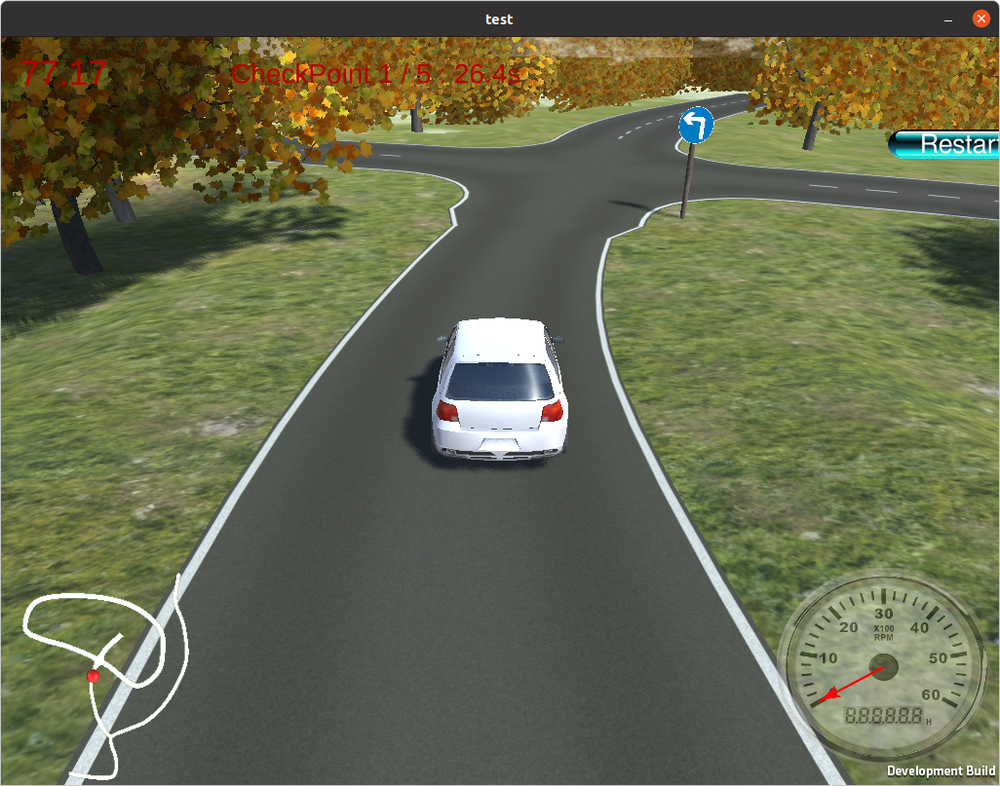
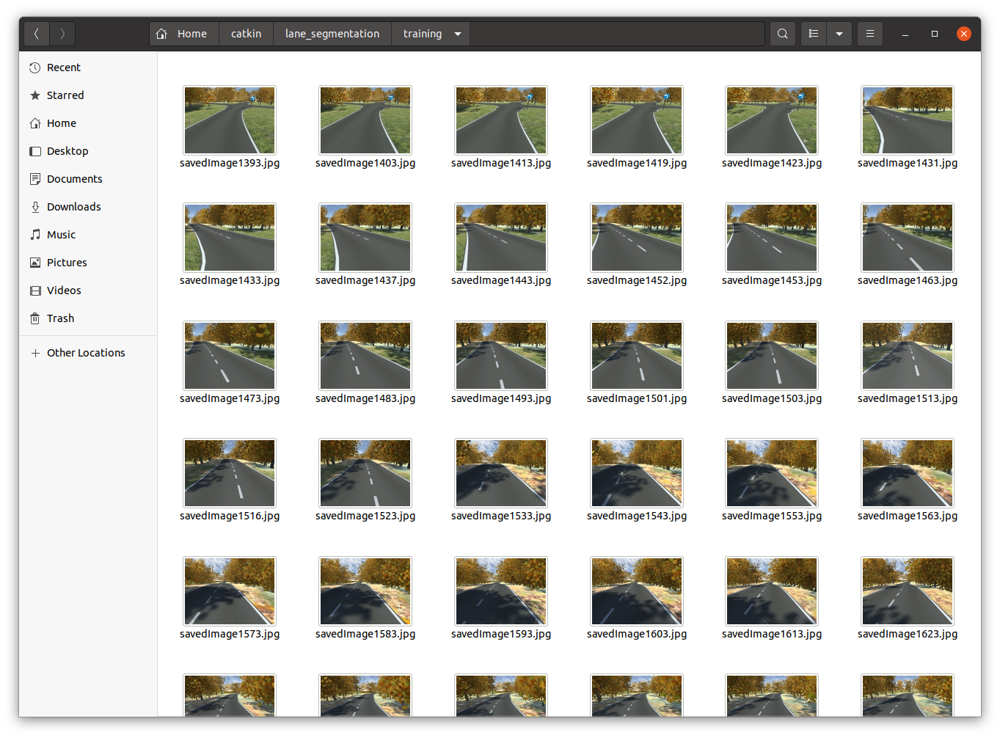
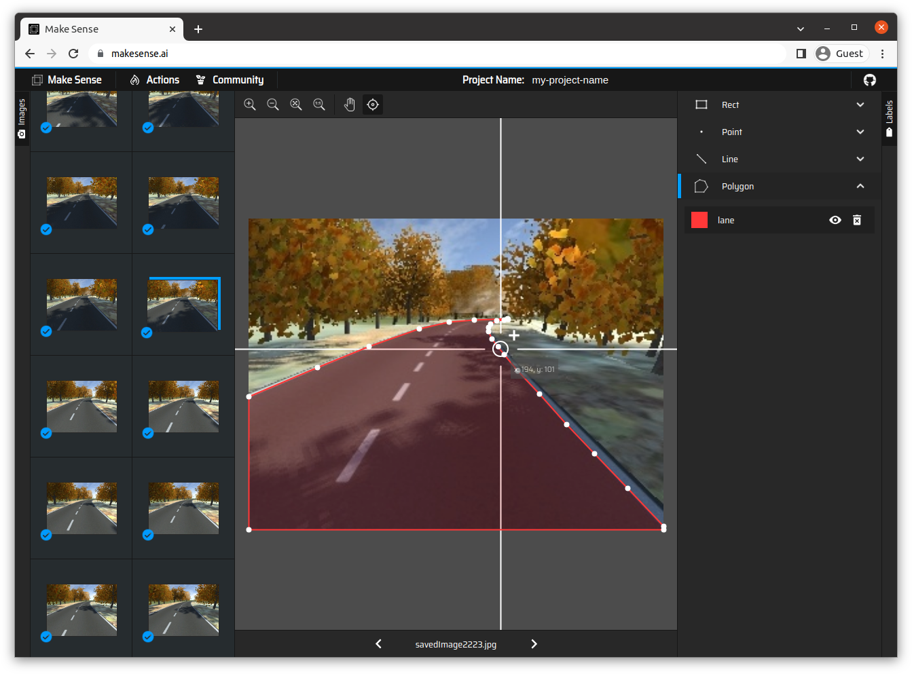

# Mask RCNN applied to Automatic Car in Simulation Environment
## Introduction
While pursuing my bachelor's degree, my team and I took part in a hackathon, FPT Digital Race, which aimed to encourage students to research how to develop an automatic car. We did not know about machine learning or deep learning, therefore, we could just use some image processing techniques to solve the problem. Now, in the Artificial Intelligence (ED6400014-001) course, we had been introduced a deep learning technique named Mask RCNN. Thus, I came up with an idea to apply it to this problem in the homework. Following are the tutorials on installing Mask RCNN and some of my results.

## Mask RCNN Installation

### 1. Prerequisites
- A Linux Distro (Ubuntu 18.04, in my case, it is Ubuntu 20.04 because I need to run ROS with Python 3, the lower version just supports Python 2)
- Python 3.6.9 (Default version of Ubuntu 18.04, if you use Ubuntu 20.04, it is difficult to install a parallel version of Python 3, which I had to do)

### 2. Installation

#### 2.1 Install VMware Workstation Player or Oracle VM VirtualBox to run a Linux virtual machine

- Download and install VMware Workstation Player.
- Download Ubuntu 18.04 Desktop image from https://releases.ubuntu.com/18.04/.
- Create Ubuntu 18.04 virtual machine with VMware Workstation Player. Remember to allocate a lot of memory and CPU cores for your training.

#### 2.2 Install Mask RCNN

- Open a terminal, and update the distro with:
```
sudo apt update
sudo apt upgrade
```
- Install pip3 manager:
```
sudo apt install python3-pip
```
- Install Jupyter Notebook, refer to https://jupyter.org/install
- Clone the project with:
```
git clone https://github.com/matterport/Mask_RCNN.git
```
- Install the required packages:
  + Replace the file `Mask_RCNN/requirements.txt` by the file in my directory: [requirements.txt](Mask_RCNN/requirements.txt)


  ```
  numpy==1.16.4
  scipy==1.5.4
  Pillow==8.4.0
  cython==0.29.34
  matplotlib==3.3.4
  scikit-image==0.17.2
  tensorflow==1.14.0
  keras==2.0.8
  opencv-python==4.2.0.34
  h5py==2.10.0
  imgaug==0.4.0
  IPython[all]==7.16.3
  protobuf==3.19.6
  ```

  + Install the packages with the command:
  ```
  pip3 install -r requirements.txt
  ```

- Install Mask RCNN with:
```
sudo python3 setup.py install
```

### 3. Train your own dataset

#### 3.1 Create your own dataset

- Create a dataset with the objects you want to detect with Mask RCNN by downloading from the Internet or taking some pictures. In my case, I created them by capturing them from the simulation and my dataset has 295 images.

- Label your own dataset using one of following tools:
    + https://www.makesense.ai/
    + https://labelstud.io/
    + https://github.com/Doodleverse/dash_doodler
    + http://labelme.csail.mit.edu/Release3.0/
    + https://github.com/openvinotoolkit/cvat
    + https://www.robots.ox.ac.uk/~vgg/software/via/
    
In my case, I used makesense.ai

- Remember to export annotations after labeling. If not, your efforts will be lost.

#### 3.2 Train your own dataset

- Try to train your own dataset by referencing [train_shapes.ipynb](https://github.com/matterport/Mask_RCNN/blob/master/samples/shapes/train_shapes.ipynb)
- Or by referencing this video: [286 - Object detection using Mask RCNN](https://www.youtube.com/watch?v=QntADriNHuk&t=884s&ab_channel=DigitalSreeni)

#### 3.3 Validate your own model

- Validate your own model using some other pictures which were not trained.

## My results

### 1. Trained results

Trained results are presented [here](lane_segmentation/train.ipynb)

### 2. Validated results

Validated results are presented [here](lane_segmentation/validate.ipynb)

### 3. Demo

#### Simulation program


#### My own dataset


#### Labeling with makesense.ai


#### Write some code to apply the detector to ROS controller
It is written in [lane_segmentation.py](src/lane_segmentation/scripts/lane_segmentation.py)

#### Run the simulation with Mask RCNN detector


#### Future works will be done to do the Warp Perspective Transformation to calculate the steering angle for the car

## References

   [1] [Mask R-CNN for Object Detection and Segmentation] https://github.com/matterport/Mask_RCNN
   
   [2] [286 - Object detection using Mask RCNN: end-to-end from annotation to prediction] https://youtu.be/QntADriNHuk


## Appendix: ROS Package Installation
### I. Installation
- Ubuntu 16.04 or newer
- One of the following versions of [ROS](https://ros.org)
    - [Lunar Loggerhead](http://wiki.ros.org/lunar)
    - [Melodic Morenia](http://wiki.ros.org/melodic)
    - [Noetic Ninjemys](http://wiki.ros.org/noetic)
    - It is recommended to install the full version
      ```
      $ sudo apt-get install ros-<distro>-desktop-full
      ```
- Create a catkin workspace
```
mkdir -p ~/catkin/src
cd ~/catkin/
catkin_make
echo "source ~/catkin/devel/setup.bash" >> ~/.bashrc
source ~/.bashrc
```

- Install rosbridge-suite
```
sudo apt-get install ros-<distro>-rosbridge-server
```

### II. Run
#### ROS Launch
```
roslaunch lane_detect lane_detect.launch
```
    
#### Unity Simulation Environment
```
Team: Team1
URL: ws://127.0.0.1:9090
```

## Updating...
